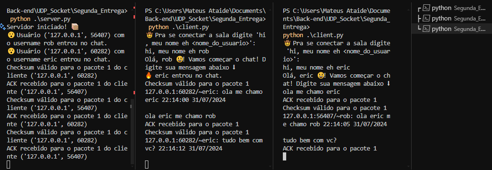

# Projeto de Redes - Transmissão de Arquivos com UDP

### Descrição do Projeto
Este projeto foi desenvolvido para a disciplina de Redes e implementa a comunicação de arquivos utilizando o protocolo UDP com a biblioteca Socket em Python. A aplicação simula um chat de sala única, onde os usuários podem enviar e receber arquivos de texto (.txt) que são exibidos no terminal de cada cliente conectado. Além disso, foi implementado o protocolo RDT 3.0 (Reliable Data Transfer), que adiciona confiabilidade à transmissão de mensagens, garantindo a entrega correta e ordenada mesmo em ambientes sujeitos a perdas e corrupção de pacotes.


# Objetivos
O objetivo deste trabalho é desenvolver um sistema de comunicação via UDP, com a implementação de um chat de sala única que permita a troca de mensagens entre múltiplos clientes de forma simultânea. Além disso, busca-se criar um ambiente de chat onde os usuários possam enviar e receber mensagens com formato específico, incluindo IP, porta, nome do usuário, mensagem e timestamp, bem como notificar os participantes sobre novas conexões à sala.

Outro objetivo fundamental do trabalho é adicionar confiabilidade à comunicação através da implementação do protocolo RDT 3.0, garantindo a transferência confiável das mensagens, mesmo em ambientes sujeitos a perda e corrupção de pacotes. Isso envolve a detecção e correção de erros de transmissão utilizando checksums, números de sequência e retransmissão de pacotes em caso de problemas.

# Bibliotecas
A biblioteca socket foi amplamente empregada ao longo de todo o projeto, desempenhando um papel fundamental na criação e na manutenção das conexões entre o cliente e o servidor.

# Como rodar
Escolha qual entrega quer rodar:
```
cd <nome_da_pasta>
```
execute:
```
python .\server.py
```
abra mais de um terminal para testar o chat:
```
CTRL + SHIFT + 5
```
Por último execute o client e se divirta 😁😎:
```
python .\client.py
```

# Screenshot



# Integrantes
Antônio Robério (arbof@cin.ufpe.br)

Daniel Dias (dmdf@cin.ufpe.br)

Eric Bezerra (eblb@cin.ufpe.br)

Mateus Ataide (mhal@cin.ufpe.br)
